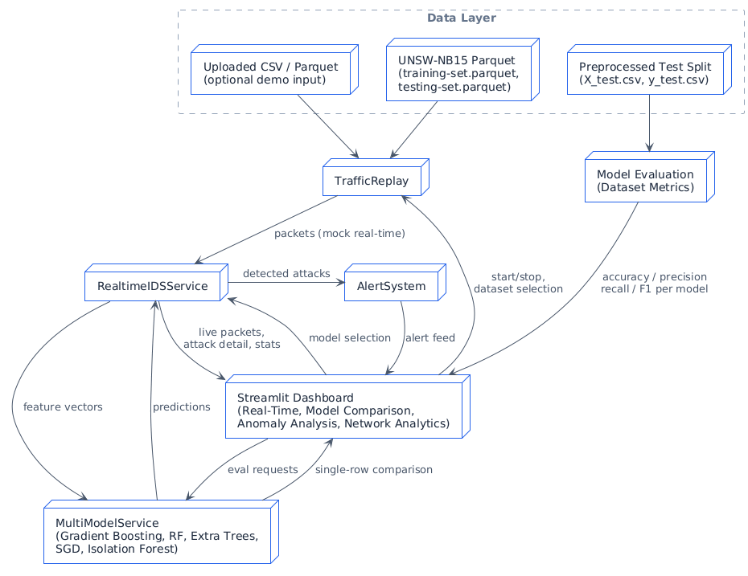

# Network Intrusion Detection Dashboard

This repo now contains only the Streamlit dashboard that replays UNSW-NB15 traffic (or any uploaded CSV/Parquet) and visualises the already-trained models stored under `models/`. Training code, APIs, notebooks, and reports were removed to keep the workspace lightweight for demos.

## Features
- **Real-time replay:** `TrafficReplay` streams UNSW traffic (or uploaded data) at demo-friendly speed with synthetic IP fallbacks.
- **Live SOC view:** redesigned dashboard with packet grid, alert feed, attack detail card, and packet-deep dive panel.
- **Model comparison:** evaluate all bundled models on any row, then run aggregated accuracy/precision/recall/F1 for a chosen dataset slice.
- **Network analytics:** protocol/service/attack charts update as packets flow; dataset summary highlights what portion has been inspected.

## System Architecture

*Figure 1: High-level architecture showing data flow, services, and the Streamlit dashboard.*

## Project layout
```
app/
  ids_dashboard_final.py      # Streamlit entry point
  services/
    realtime_ids_service.py   # Orchestrates replay + prediction
    multi_model_service.py    # Loads multiple joblib models
models/                       # Pretrained estimators (.joblib)
src/
  alert_system.py             # Alert aggregation + severity mapping
  config.py                   # Shared paths + replay constants
  traffic_replay.py           # Replay helper (UNSW parquet or uploads)
data/
  raw/testing-set.parquet     # Required for default replay
  processed/X_test.csv        # Used for model benchmarks
```

## Getting started
1) **Set up the environment**
```bash
python3 -m venv .venv
source .venv/bin/activate
pip install -r requirements.txt
```

2) **Place data and models**  
Data files are compressed to save space.  
- **Extract** `data.rar` (or `.zip`) to the project root so you have a `data/` folder containing `raw/` and `processed/`.
- Ensure `models/` folder contains the pretrained `.joblib` files.

The dashboard requires:
- `data/raw/testing-set.parquet`
- `data/processed/X_test.csv` & `y_test.csv`
- `models/*.joblib`

3) **Run**
```bash
streamlit run app/ids_dashboard_final.py
```
Default port: http://localhost:8501.

### Docker
```bash
docker build -t ids-dashboard .
docker run --rm -p 8501:8501 ids-dashboard
```

## Make targets
- `make install` – install dependencies
- `make app` – run Streamlit dashboard
- `make clean` – drop caches (`__pycache__`, `.streamlit`)
- `make docker_build` / `make docker_run`

## Data & models
Keep `data/raw/testing-set.parquet`, `data/processed/X_test.csv`, `data/processed/y_test.csv`, and the `models/*.joblib` artifacts in place. Uploaded demo files are optional and handled dynamically via the UI.
